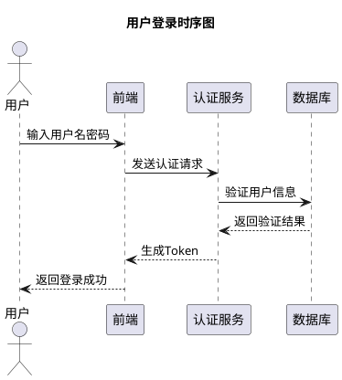

# 一级标题
## 二级标题
### 三级标题
#### 四级标题
##### 五级标题
###### 六级标题
正文
# 系统架构设计

## 用户登录流程


<script src="{{ '/assets/js/downloader.js' | relative_url }}"></script>

[链接下载](https://www.opendesign.com/guestfiles/get?filename=ODADrawingsExplorer_QT6_lnxX64_8.3dll_27.1.AppImage)
<button onclick="downloadViaWorker('https://www.opendesign.com/guestfiles/get?filename=ODADrawingsExplorer_QT6_lnxX64_8.3dll_27.1.AppImage', 'ODADrawingsExplorer_QT6_lnxX64_8.3dll_27.1.AppImage')" class="download-btn">通过rWoker下载</button>
# 代码块
```
abc = def
cde = good
```
This is a Chinese website. If your browser does not support Chinese, or if you do not understand Chinese, this website is not suitable for you.  
这是一个中文网站。如果您的浏览器不支持中文，或您不懂中文，那这个网站不适合您。